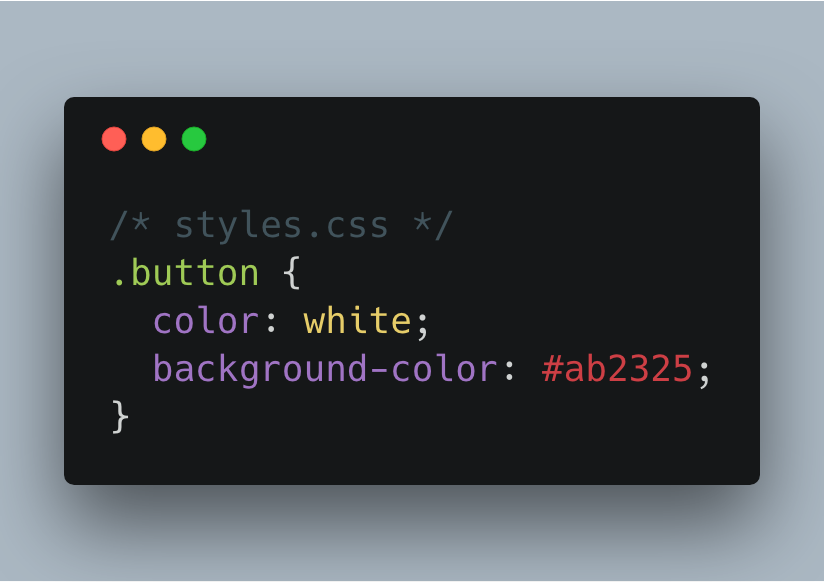
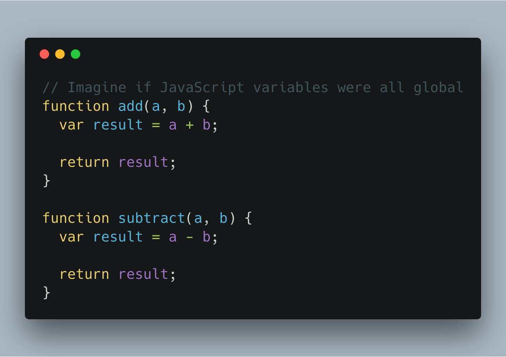
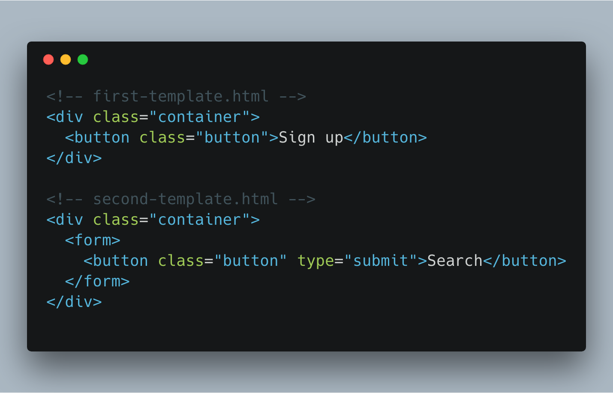
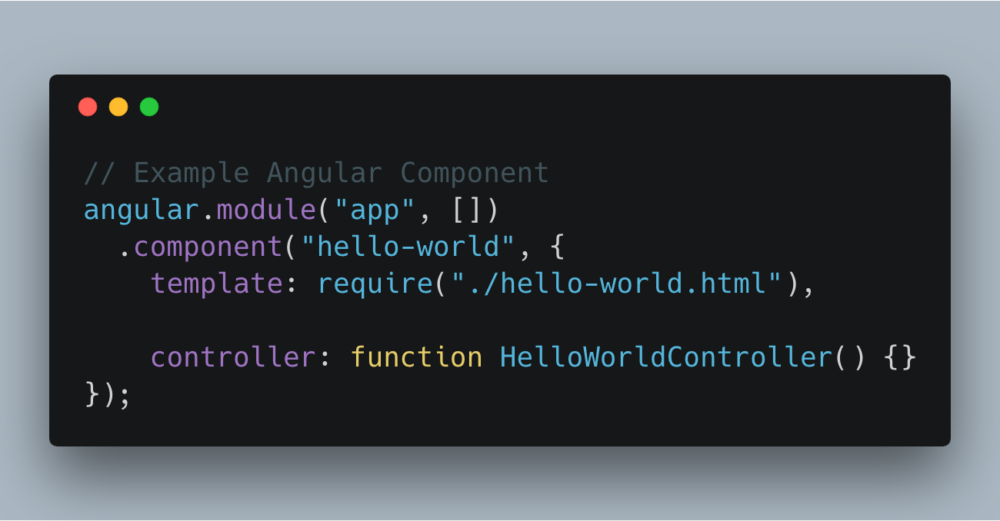
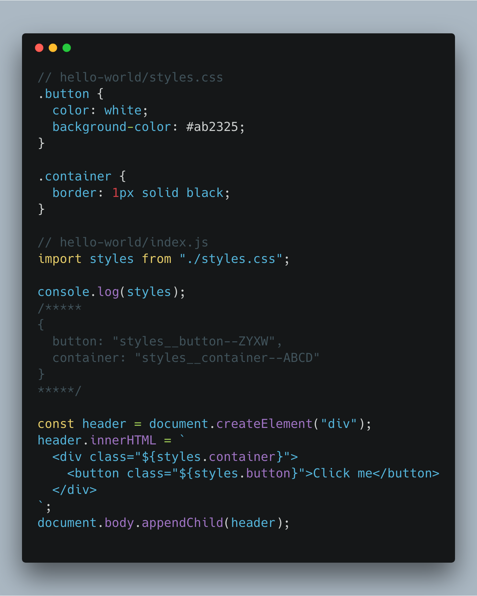
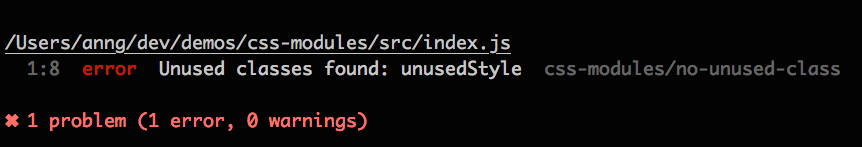
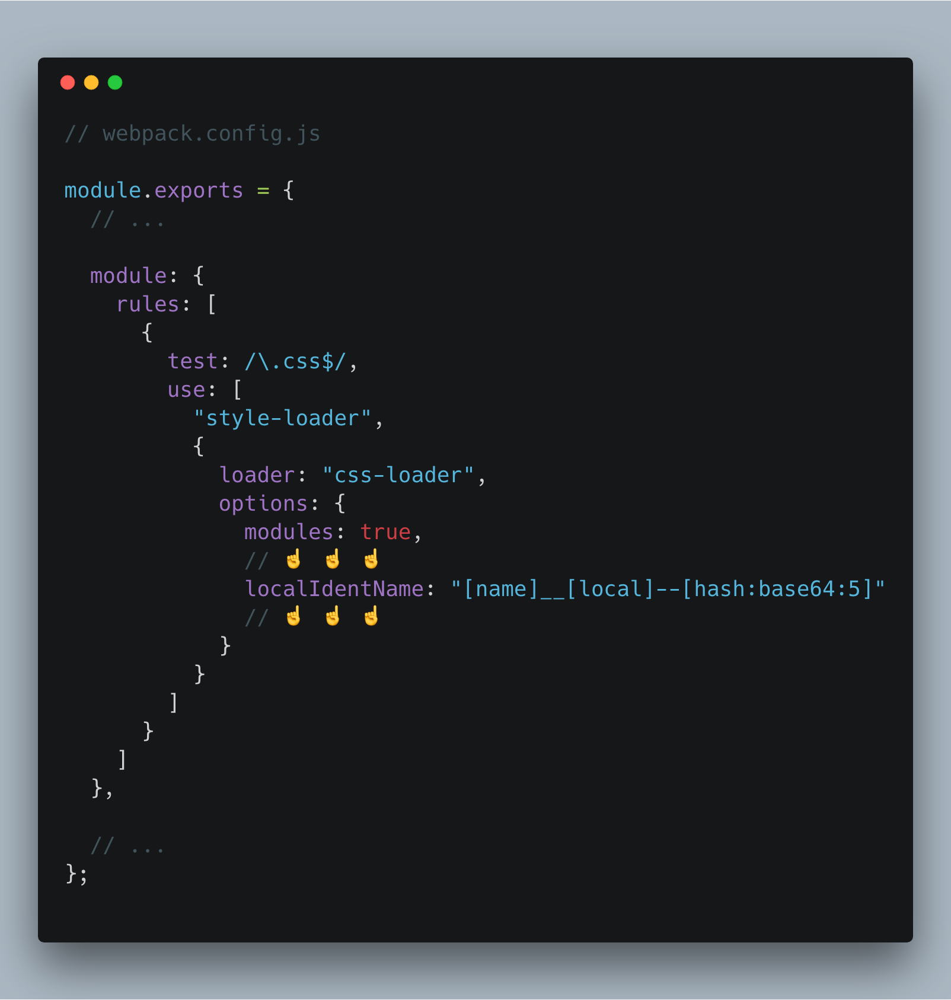

# CSS Modules demo

# Getting started

```shell
npm install
# Download dependencies

npm run build
# Runs webpack and automatically opens webpage
```

---

# What are CSS Modules

## CSS is global

In JavaScript, we know that global variables are bad. We have patterns (such as [Revealing Module Pattern](https://addyosmani.com/resources/essentialjsdesignpatterns/book/#revealingmodulepatternjavascript)) and ES6 modules to prevent global variables.

By default, CSS class names are global.

If I have this `.button` class name in my stylesheet...



...all of my HTML would be affected by it.

Another problem we run into is naming things.

[](https://twitter.com/secretGeek/status/7269997868?ref_src=twsrc%5Etfw&ref_url=https%3A%2F%2Fmartinfowler.com%2Fbliki%2FTwoHardThings.html)

Naming is hard. Imagine if all JavaScript variables were global. If a name conflicted with another name, you would have to come up with another name.



That is the problem that CSS has.



The duplicated `container` and `button` class names would break your styling.

)

There are other methodologies like [BEM](http://getbem.com/) that provide solutions, but you still have to create your own names.

## What are components?

When we think about Angular components, we imagine something like this:



This component encapsulates everything we need, right? With templates, our `hello-world` component knows what content it is displaying. With the controller, our `hello-world` component knows about its interactivity.

But what about the styling? We would have to copy and paste the CSS code to some stylesheet. And then hope that we don't have any name conflicts.

It shouldn't be like this.

## CSS modules to the rescue

A CSS Module is a CSS file in which class names are scoped locally ([you can read more about CSS Modules here](https://github.com/css-modules/css-modules)).

## How to use it?

In your JavaScript files, you import CSS modules from your CSS files. The CSS module is an object with a mapping of your class names.



If two modules want to use the same class names, they can! You don't have to care about unique class names anymore.

Another benefit is the linting support. Because normal CSS is global, it is not simple to tell if a CSS selector will be used.

But with CSS Modules, we can easily tell what CSS is being used. The community has created plugins that warn you of unused CSS class names.



## Webpack setup

The webpack setup is not that complicated. Luckily, the css-loader that we are using supports CSS Modules.



To have truly reusable components, we need a way to encapsulate HTML, JavaScript, and CSS. CSS Modules helps with the CSS.
